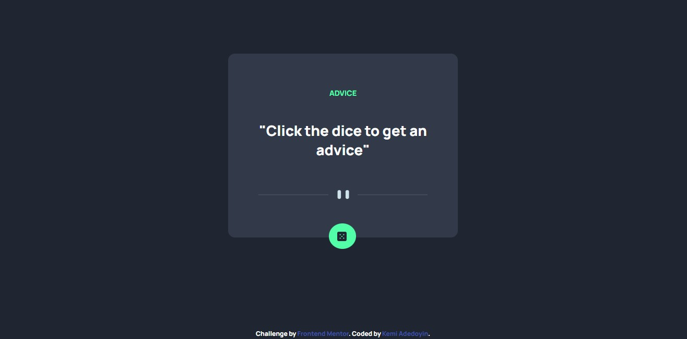

# Frontend Mentor - Advice generator app solution

This is a solution to the [Advice generator app challenge on Frontend Mentor](https://www.frontendmentor.io/challenges/advice-generator-app-QdUG-13db). Frontend Mentor challenges help you improve your coding skills by building realistic projects.

## Table of contents

- [Overview](#overview)
  - [The challenge](#the-challenge)
  - [Screenshot](#screenshot)
  - [Links](#links)
- [My process](#my-process)
  - [Built with](#built-with)
- [Author](#author)
- [Acknowledgments](#acknowledgments)

## Overview

### The challenge

Users should be able to:

- View the optimal layout for the app depending on their device's screen size
- See hover states for all interactive elements on the page
- Generate a new piece of advice by clicking the dice icon

### Screenshot

### Links

- Solution URL: [Github](https://github.com/KemiDoyin/Advice-Generator-App)
- Live Site URL: [Netlify](https://advicesgeneratorapp.netlify.app/)

## My process

### Built with

- Semantic HTML5 markup
- CSS custom properties
- Flexbox
- Mobile-first workflow

## Author

- Website - [Kemi Adedoyin](https://kemiadedoyin-ka.netlify.app/)
- Frontend Mentor - [Kemi Doyin](https://www.frontendmentor.io/profile/KemiDoyin)
- Twitter - [Kemi Adedoyin](https://twitter.com/KemiAdedoyin_)

## Acknowledgments
I would like to appreciate a special person who has always helped me out [@Mcnoble1](https://github.com/Mcnoble1)

